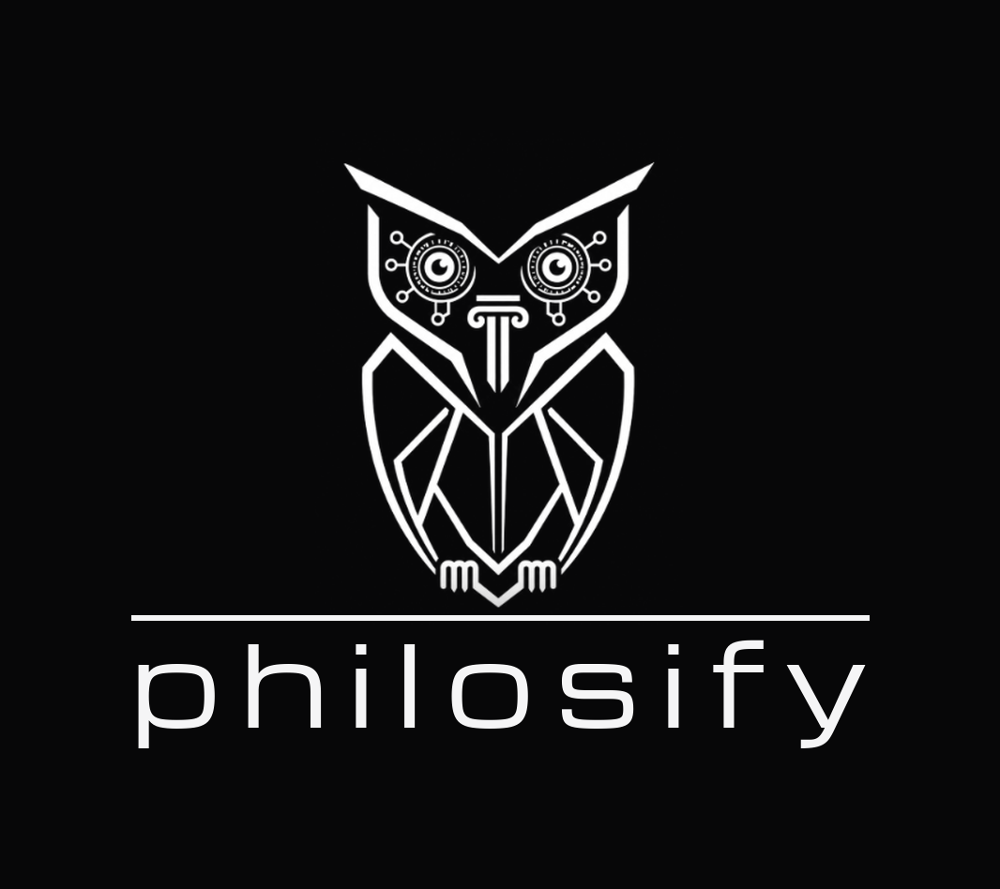

# PHILOSIFY DESIGN LAW — FROZEN
**Status: NON-NEGOTIABLE. Ratified by Roberto Rachewsky, 28 Jul 2026.**
No value in this document may be changed, "improved," approximated, or reinterpreted by any agent, developer, or designer without Roberto's explicit approval. A build that deviates from this law is rejected. New surfaces inherit this law in full. Reference implementations: `philosify-tokens.css` (v2) and the approved mockups (landing = master; News = module-template standard).

---

## 1. BRAND

### 1.1 The Mark — the Owl of Athena
Roberto's own artwork: sharp V ear tufts, mechanical/circuit eyes, a Greek column as the beak, faceted crystalline shield body, small talons. Portrait ratio (322×432 source).
- **Two cuts, fixed domains:** the **faithful cut** (original linework, smooth edges, untouched stroke weight) for all top lockups (≥64px render); the **reinforced cut** (brightness-boosted strokes) for footer sizes (≈30–33px). Never swap domains.
- **Always white on always-black ground — with one theme exception (amended 30 Jul 2026).** On the dark interface the white lockup sits directly on the canvas. **Inside the product, when the WHITE theme is selected, the owl and the brand become BLACK on the white background** (dedicated black-ink assets: `philosify-logo-lockup-black.png`, `philosify-logo-horizontal-black.png` — swapped by theme, never CSS-reconstructed). Outside the product, on light surfaces (documents, third-party placements, Stripe), the black plate applies: white-on-black chip. Never grey, never dimmed, never tinted.
- The artwork is never redrawn, thickened, thinned, cropped, or restyled. Sanctioned pending work: SVG vectorization of both cuts as faithful reproductions.

### 1.2 The Wordmark
- **"philosify"** — lowercase, Michroma, always. Never "philosify.org" as wordmark (the domain appears only as a URL line). Never uppercase, never bold, never gradient (tested and rejected: reads as a shadowed font).

### 1.3 Lockups — mark and wordmark are one unit, never separated

*The official lockup, reference render (`philosify-logo-vertical.png`, 4× master). Exact measures in `philosify-logo-spec.md`. This image is normative: where words and picture could be read differently, the picture wins.*

**Application rule (amended by Roberto, 28 Jul 2026):** the lockup is placed as the **single official image asset** — `philosify-logo-lockup.png` (vertical) / `philosify-logo-horizontal.png` (footers) — scaled to the size ladder. It is NEVER reconstructed per page from parts (owl file + CSS line + live text): per-page redrawing caused vertical misalignment and is forbidden. The geometry spec exists to regenerate the master asset, not to rebuild the logo in markup.

**Vertical lockup** (mastheads):
- A continuous horizontal line spanning **exactly 100% of the wordmark's width (p-to-y)**, centered; the owl stands on it, talons overlapping the line by ~2–3px; the wordmark sits **≈0.5mm below the line, measured by INK** — the distance from the line's bottom to the letter tops (h/l/f), never to the font's bounding box (Michroma carries large internal top-bearing that must be compensated). Letter-spacing .16–.2em with end-tracking compensation. **This geometry is universal — the logo in any circumstance** (amended by Roberto, 28 Jul 2026; supersedes the earlier 150% line).
- Sizes (AMENDED 30 Jul 2026 — "a coruja fica apenas no header"): the lockup lives **solely in the fixed header bar**, ~64px inside the ~80px bar, on EVERY page — the centered page mastheads are **retired**, landing included. All content scrolls beneath the bar. The lockup is always a link home.

**Horizontal variant — RETIRED (Roberto, 30 Jul 2026):**
- The horizontal construction is abolished. The OFFICIAL vertical lockup is the logo in ANY circumstance — including the permanent fixed header bar, where it appears at the interior size (~64px) inside a taller seamless bar (~80px), theme-swapped to the black-ink asset on the white theme, always a link home. The footer carries NO lockup; the brand appears once, in the bar. Horizontal assets are archived, not used.

**No solo-mark exception:** the full lockup (owl + line + word) is the logo in ANY circumstance, favicons and app icons included (amended by Roberto, 28 Jul 2026 — the owl never appears without her name).

---

## 2. COLOR — MONOCHROME + SILVER

Cyan, magenta, violet, and all accent hues are **retired from the interface** *(amended 30 Jul 2026: two functional returns by Roberto's ruling — magenta `#D6158C` on analysis progress bars and cyan `#59D4E4` on module titles; "um pouco de cor não faz mal a ninguém — dá vida")* (the promo films keep their own palette as embedded content only). Constellation school colors are **data, not UI**, and survive inside the map.

### 2.1 Dark theme (default)
| Role | Value |
|---|---|
| Canvas | `#070708` |
| Cell surface | `rgba(255,255,255,.022)` |
| Inset (inputs, deep wells) | `#000000` |
| Inverted block (Unsafe Zone cell, AI voice) | `#F5F5F6` bg / `#0A0A0C` text, full contrast (no opacity dimming) |
| Ink — titles, brand | `#F5F5F6` |
| Ink — text inside boxes/cells & tickers | `#F5F5F6` — WHITE (30 Jul: all grey reading options rejected as illegible; hierarchy comes from font and size, not tone) |
| Ink — chrome mid | `#9C9CA3` |
| Ink — faint chrome, labels | `#5E5E65` |
| **Silver (sole emphasis)** | `#DDE1E8` |
| Silver-dim (tagline) | `#C9CDD6` |
| Hairline | `rgba(255,255,255,.11)` |
| Strong line | `rgba(255,255,255,.28)` |
| Grid line | `rgba(255,255,255,.045)` |
| Functional error (APPROVED by Roberto, 29 Jul 2026) | `#FF5A5A`, error states only, never decoration |
| Analysis progress/timer bars (APPROVED 30 Jul 2026) | `#D6158C` — functional only, never decoration |
| Module titles — the 8 modules, Unsafe Zone excepted (APPROVED 30 Jul 2026; extended 30 Jul: applies on the LANDING grid cell titles too) | `#59D4E4` (white theme: `#1E7E8C`) |

### 2.2 White theme
Canvas `#FFFFFF`; inks invert (`#0A0A0C` / `#4C4C54` / `#8C8C92`); silver → **graphite** `#3A3E46` (dim `#4A4E56`); inverted block flips to black-on-page; the brand lockup inverts to the BLACK-ink assets on the white canvas (Law §1.1, 30 Jul amendment).

### 2.3 Silver care rules (law, not guidance)
- Silver is a **flat tone — never a gradient** (tested and rejected).
- Marks **meaning only**: declared quantities, one key phrase per cell, the tagline, balance/credit numerals, the Philosophical Note numeral, ticker stats.
- **Maximum one silvered element per region.** Never on buttons, borders, backgrounds, whole paragraphs, ads, or the brand.

---

## 3. TYPOGRAPHY — THREE FONTS, CLOSED

| Font | Territory |
|---|---|
| **Michroma** (400 only) | Wordmark, page/module titles, tagline, cell titles **and descriptions** (one font inside buttons), ticker headline text, display numerals (Note, pack sizes, History IDs) |
| **Inter** (400/500) | All chrome: telemetry, labels, buttons, pills, inputs, dates, footer links; the guide-compliance code (`tabular-nums`, tracked uppercase, telemetry grey) |
| **Newsreader** | Reading prose: analysis sections, Unsafe Zone dialogue, scan excerpts, legal body (16.5–17px / 1.75–1.8) |

- **No fourth font** (Electrolize and Tomorrow evaluated and declined).
- Per-locale **Noto fallbacks** behind all three for the 18 languages; non-Latin headers render in bold tracked fallback.
- Key settings: display letter-spacing .13–.2em with negative end-margin compensation; meta/telemetry 10–11px, .14–.22em tracking, uppercase; cell titles ~15.5px / descriptions ~11.5px, line-height 1.65; sentence case everywhere except tracked-uppercase chrome.
- **The six questions are highlighted (Roberto, 30 Jul 2026):** within analysis prose, the passages answering **what, who, when, where, how and why** (o quê, quem, quando, onde, como, por quê) render in the flat silver register — the reader's eye finds the factual anchors of the analysis at a glance. Implemented via the `<hl>` tag emitted by the engine; silver stays flat, never a gradient, and marks meaning only.
- **Prose is JUSTIFIED (Roberto, 30 Jul 2026):** all reading-tier text — analysis sections, rationale, historical context, Unsafe Zone dialogue, legal body — renders `text-align: justify` with `hyphens: auto` (keyed to the page's `lang` so hyphenation follows the locale). Chrome, labels, tickers, titles and cell descriptions stay left-aligned (RTL: right).

---

## 4. SPACE, GEOMETRY, SURFACE

- **Grid veil:** 64px square cells, hairline at grid-line value, viewport-fixed, radial fade to nothing at the screen's extremes; uneven atmospheric light pools beneath. The grid never tiles uniformly edge-to-edge.
- **HUD:** four 24px corner brackets (1px, faint), telemetry text at the frame's edges; identity top-right (username ▾ / Sign in), language pill beside it.
- **Containers:** page column 1080px (48px side padding); reading well 720px; shell max 1240px.
- **Cells:** square corners (radius 0), 1px hairline border, cell-surface fill, padding 24px (compact 20–22px), grid gaps 16–20px; corner **→ affordance** top-right, brightening + 3px shift on hover; hover = border sharpens + a 1px white underline sweeps left→right (.38s); "Select a module" instruction line above module grids.
- **Radii:** cells 0; inputs 6px; pills 999px. Buttons: primary = white fill / black text (the inversion as maximum action, one per screen); secondary = hairline outline.
- **Page vertical order (amended 30 Jul 2026):** fixed header bar (official lockup + session chrome, seamless ground) → then, scrolling beneath it: MODULE NAME (cyan) → marker line with end-node → ticker → content. Landing: bar → tagline → marker → module grid → footer, all beneath the bar. **Header and footer carry NO dividing hairlines** (Roberto, 29 Jul 2026): no bottom edge on any fixed/top header bar, no top edge on the footer — separation by ground and spacing alone. **The fixed top bar's ground is the page itself** (Roberto, 29 Jul 2026): canvas color plus the identical 64px grid pattern, viewport-aligned so the bar is indistinguishable from the canvas — content scrolls under a seamless continuation of the page, never under a flat strip. **The bar hosts the OFFICIAL vertical lockup (30 Jul 2026)** — never the retired horizontal variant — with the session chrome (language, balance, account) at its right, and session chrome lives in the bar ONLY (no duplicates in the body).
- **Landing:** 3×3 module grid, order Music, Cinema, Literature, News, Ideas, History, Quiz, Community, Unsafe Zone (inverted cell); no index numbers, no icons/symbols, no stat column; factual one-sentence descriptions with quantities; account rail under the masthead line (Balance: N Credits · Buy Credits · History).
- **Motion:** entrance fade-up .55s ease-out, ~50ms stagger; marker line draws in 1.1s; `prefers-reduced-motion` collapses all.
- **Navigation law:** modules are **pages** (URL, back button, full viewport); modals are for transactions only (Buy Credits, Confirm spend, quick History). >30 seconds of reading/searching/spending = a page.

---

## 5. CHANGE CONTROL

0. **Migration principle (Roberto, 28 Jul 2026):** this Law serves the product, not itself. Where any provision proves counterproductive, illogical, or limiting to development and scale, it migrates to a new standard — by Roberto's dated amendment, never by agent drift. Stability is the default; evolution is the ruling.
1. Every value above is frozen. Agents implement; they do not editorialize.
2. Deviations, "optimizations," or substitutions require Roberto's explicit written approval, recorded as an amendment to this document with a date.
3. Open items awaiting Roberto's ruling (the only permitted gaps): News source count; debate-creation cost. Resolved: error-red approved functional-only (29 Jul); pack prices bind live Stripe; philosopher count binds the seed live; WP0 closed on the PNG cuts (no vectorization); Constellation year-readout ruled chrome — silver Michroma (29 Jul).
